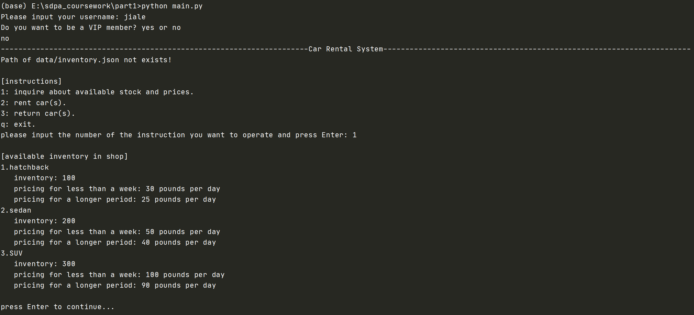

# sdpa_coursework
This is the coursework for SDPA at the University of Bristol.

## Part 1: Car Rental System
This is a Car Rental System.
#### Run code
```
cd part1
python main.py
```
When you run code, you will see the following interface.

Then you can input your username. The program will ask whether you want to 
be a VIP member. If you are not the first time to run this program and 
input the same name have been signed up, the program will not ask whether
you want to a VIP member. <br/>

When you have finished logging in, you can start to operate the relevant instructions.
- 1: inquire about available stock and prices.
- 2: rent cars(s).
- 3: return cars(s).
- q: exit.

This program has been tested many times and can handle almost all abnormal input.

**Note: For the sake of friendly interface, the program will prompt you to press enter 
to continue after executing an instruction each time.**


#### Unittest
```
python carRental_test.py
```


## Part 2: Algorithm Analysis
Design the algorithm and analyse its complexity.


## Part 3: Data Analytics
This part is to analyse the weather data in Shanghai from 2017 to 2019
#### Install the package:

```
pip install wwo-hist
```